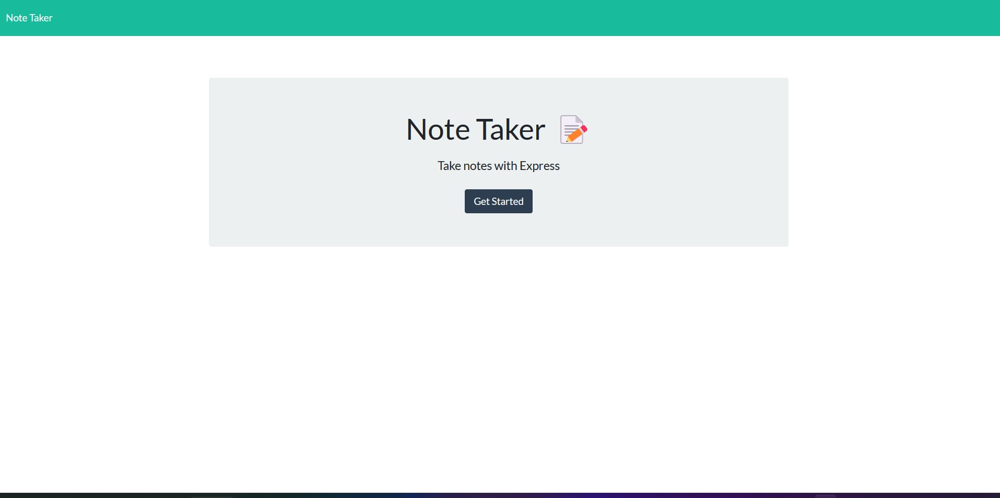

# note-taker-app
The goal of this project is to make a note-taking app that can allow the user to add and remove notes with titles and content. The front end has already been developed but the backend has to be created using Express.js 

## Table of Contents

* [Description](#description)
* [Usage](#usage)
* [References](#References)
* [Credits](#credits)
* [License](#license)

## Description
This project's objective is to modify starter code to create an application called Note Taker that can be used to write and save notes. This application will use an Express.js back end and will save and retrieve note data from a JSON file. It will also allow the user to delete notes. 

The application’s front end has already been created. It's your job to build the back end, connect the two, and then deploy the entire application to Heroku.

     
## Usage

* Navigate to the [Note Taker Site](https://note-taking-app-ajl.herokuapp.com/) to view the web page 
* Checkout the [Note-Taker-App](https://github.com/AlbertoJL3/note-taker-app) repo in GitHub.
* You can clone down the repo and run it locally by opening the directory and doing "npm start" and you'll be able to find it in your [Local Host URL](http://localhost:3001)!

## Screenshot

## References
1. [Deploying on Heroku](https://devcenter.heroku.com/articles/git).
2. [Buildpacks](https://devcenter.heroku.com/articles/buildpacks) 
3. [Routes in Express.js](https://expressjs.com/en/guide/routing.html)

## License

